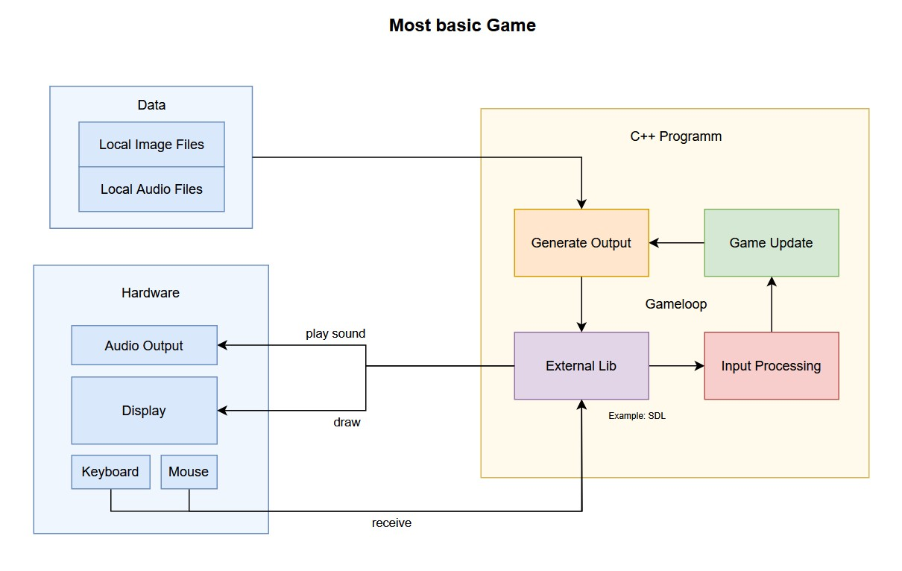
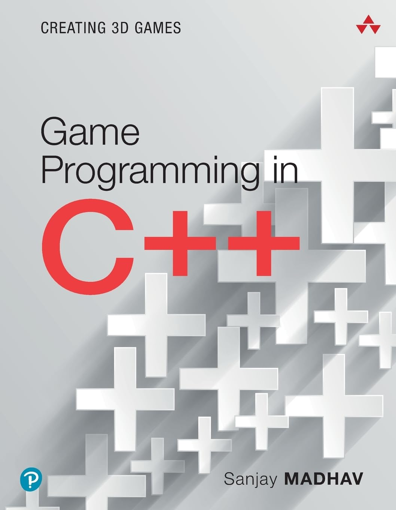
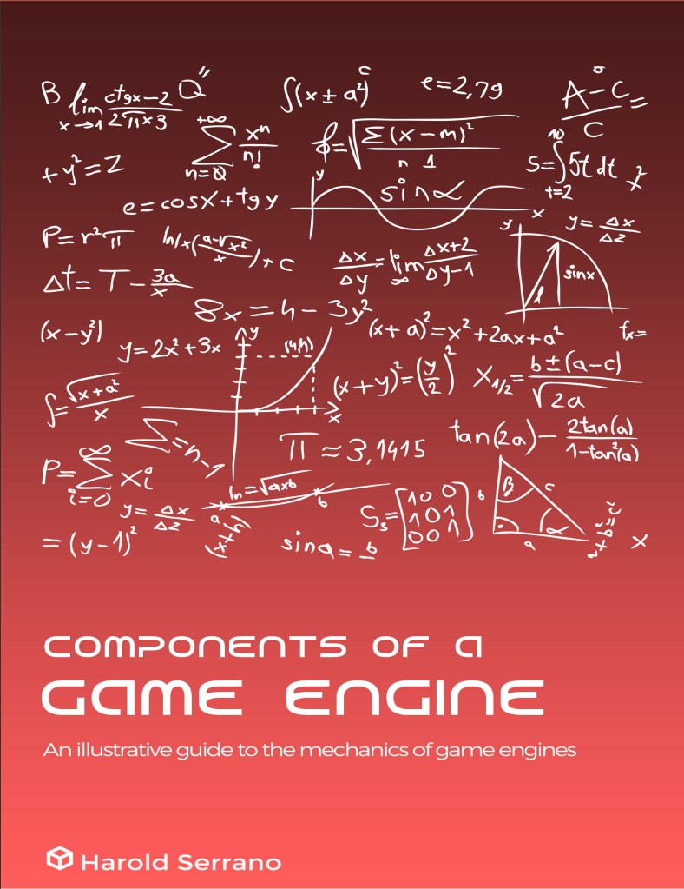

[go back](../README.md)

# Game

Knowledge about game programming is collected here.


Contents:
- [Game Loop](#game-loop)
- [Game Engine](#game-engine)
- [Game Development](#game-development)
- [Game Design](#game-design)
- [Graphics Creation](#graphics-creation)
- [Audio Creation](#audio-creation)
- [Ressources](#ressources)
- Examples
	- [Simple SDL Game](#simple-sdl-game)
	- ...


---
### Game Loop

The Game loop is the loop within the game logic and graphics get updated. Different to other applications, a game have to run a loop where the game gets updated until the game ends. 

The famous **FPS** comes right from here. The game loop can run multiple times per second and the FPS (frames per second) says how often the game loop runs in one second. Therefore one iteration of the game loop is called **frame**.

On a high-level this can be splitted into:
- **Input Processing**<br>
	Which can be the input from a controller, keyboard, GPS, ... These can be from one player or for an server with multiple players there would be multiple inputs every frame.
- **Game World Update**<br>
	Updates every object in the game (if needed). For example to apply gravity or updating the position when the player pressed 'w'.
- **Output generation**<br>
	The output is the rendering (graphics), audio (->music, dialogue, effects), controller feedback (like shaking) or sending data to players (in multiplayer games...).

Note that the game loop is paused during 'pause' (if existing) for example by pressing the settings or the menu and the game loop not even started if the game is in the start menu. Sometimes some parts of the game still  loops when pasuing the game. For example some games still let update some graphics or sounds.

Following graphic shows that process:

</img>

Created with the helpful and easy to use to from [draw.io](https://draw.io/).


---
### Game Engine

...


---
### Game Developement

It follows a list of important tasks during game developement. It is helpful to see the overview to be able to control where to focus on and where to exclude the work by using a tool other someone others work (paid or free). Thus this gamedev work can be vary pretty much depending on the settings of your project. But it can be helpful to once think about it. Also notice that some aspects of gamedevelopement might not are covered.

- Gameprogramming
	- Gameflow
	- Rendering
	- Physics
	- AI (NPC programming)
	- Audio
	- Network (Multiplayer/Network feature)
	- UI/UX
- Audio
    - Sound Effects
    - Musik
- Graphics 
    - 3D Models
    - Textures
    - Animations
- Story Writting
	- World/Lore
	- Main Quest
	- Side Quests
	- Characters
	- Items (Books, ...)
- Gamedesign
    - 3D/2D
    - Plattform
    - Player Controls (keyboard/gamepad + attacking, collecting, ...?)
    - Theme (colorful, dark, ...?)
    - Timeperiod & Place
    - Mood (Hard Survival, lifeful beach, ...)
    - Singleplayer or Multiplayer?
    - Which "rules" are there? (does not have to make sense)
    - Map/Level Design
	- Players goal -> motivation to play
	- Progression system
	- Process Feedback
	- ...
- Right & Law
- Selling


---
### Game Design

...


---
### Graphics Creation

In order to create graphics for your game you need a software to handle this. There are many different kinds of graphics and many ways to create graphics. Here we use the free graphics software [Blender](https://www.blender.org/) and for 2D Pixelart I recommend using [Aseprite](https://www.aseprite.org/).

**Pixelart with Aseprite**<br>
Just buy and download Aseprite in the Steam store. In 2D Pixelart it is most likely pretty easy, we only need 2D png images (because png have transparency information) and that is all. Animations also are just a series of 2D images. Aseprite helps us to create 2D Pixelart and also to create animations.

> Naming: Sprite refers to a 2D graphics/drawing and Canvas refers to a plane where you can draw.

Great on Aseprite is that is easy to use and still offers many helpful and great tools. On the left is the color palette, which contains all used colors. If you use a new color, it will be automatically added there. There are also some presets and you can save and load your color palettes. Remove a color just by selecting it and click 'entf' key-button. You can also choose how your palette is sorted.<br>
Next thing to know is that you have always 2 colors in aseprite. One on the left and one of the right mouse button.<br>
Holding the space bar will activate the hand tool for that time and you can move your graphic.<br>
Next lets talk about the tools of Aseprite which are on the right side:
1. **Selector**: Here are different tools for selecting your art, for example if there are multiple objects or you want to apply rotation only on a specific part, you want to select it and here are many different tools for that.
2. **Pencil**: here are your tools to draw.
3. **Eraser**: this tool allows you to delete things you have done.
4. **Color Picker**: To pick a color which you see.
5. **Hand Tool**: Allows to drag the canvas without moving your sprite.
6. **Move Tool**: Allows you to move your sprite on your canvas.
7. **Gradient Tool**: Provides functions for creating color gradients.
8. **Line Tool**: Can be used to create lines and curves with ease!
9. **Rectangle Tool**: Let you draw rectangle and circles (filled or not).
10. **Contour Tool**: Let you create a filled shape.
11. **Blur Tool**: Let your pixelart blurred or fragmented.

Of course all tools have more information and options with changes some aspects of their functions but it is now easy to try it out by yourself.

Your canvas and your sprite on it are of course in the middle of your screen.

Another important concept are the layers and the frames. Your graphic can have multiple layers, which is helpful due to the fact, that you can apply some effects only on one layer without destroying or changing the other layers.
Create a new layer by going to "Layer" on the top and click "new Layer". The layers can be seen in the bottom middle of the screen together with the frames. The button "show timeline" on bottom right activate/deactivate the layer/frames window.<br> 
The frames are only important for animations and makes it as simple as it can possible be. There are timesteps (1, 2, 3, ...) and each timestep is its own canvas/sprite.  Meaning if you change something on the canvas in step 2, the canvas in step 1 will stay the same. You create a new frame by clicking "new frame" in the "frame" section on the top.<br>
You can also work with layers and for example let a layer appear more from step to step by right clicking on a cel (the white circle) and changing its opacity from frame to frame.<br>
Last important thing is the duration of a frame which can be setted manually for every frame by right clicking on the number of the frame and select "frame properties".

Lastly lets go quickly over the features on the top of Aseprite and then we are finish with introducing Aseprite and you are theoretically ready to start making your own 2D pixel graphics in Aseprite.<br>
1. **File**: Let you create a new graphic, open a graphic, save a graphic and export an graphic.
2. **Edit**: Contains some basic file editing functions and general preferences.
3. **Sprite**: Change and view the properties of your sprite (including a resizing with nearest neighbor).
4. **Layer**: Provides functionality for your current/active layer.
5. **Frame**: Provides functionality for your current/active frame.
6. **Select**: Have useful tools for selecting (like inverting the selection, deselecting and selecting by a specific color range).
7. **View**: Settings to your view (like showing a grid).
8. **Help**:  Helps with some important links (like the link to the official documentation).

Now you know everything you need to know to start with Aseprite! 🥳

**Making Pixelart**<br>
...


**3D Game Assets with Blender**<br>
3D graphics most likely consists in 2 steps. The modelling of the 3D shape and the texturing of the shape (including the material settings). Both can be done in blender.

FIXME


---
### Audio Creation

To create soundeffects (like attacking, draw your sword, bumping into an objects, conversations, ...) and to create background music for your game you need a digital audio workstadion (DAW). There are many DAWs which provide different features and are differnt in userfriendliness. Here we will discuss the game audio creation with the software [Cakewalk by BandLab](https://www.bandlab.com/products/cakewalk).<br>
Expectation is to create simple sounds and songs by experimenting without much music theory knowledge, but of course music theory knowledge is helpful in this process.


**Installtion DAW**<br>
To install Cakewalk by BandLab as DAW, you have to go to the website: https://www.bandlab.com/products/cakewalk and click on the windows download and follow the instructions of the installer. Finish!


**Creating Soundeffects** (only using digital sounds)<br>
FIXME


**Creating background music**<br>
FIXME


**Using real sounds**<br>
You can also record any sounds and use them sololy or modified in Cakewalk, like:
- nature (water, birds, ...)
- instruments (guitar, piano, ...)
- object/action sounds
- ...

The degree how heavily you edit it is your decision. It is great to turn a usual sound to something very unique.


---
### Ressources

Probably best ressource:


</img>

**Game Engine Architecture, Third Edition** by Jason Gregory (2018/2019)
- [amazon link](https://www.amazon.de/Engine-Architecture-Third-Jason-Gregory/dp/1138035459/ref=sr_1_1)
- [thalia link](https://www.thalia.de/shop/home/artikeldetails/A1048142533)

<br><br>

</img>

**Game Programming in C++: Creating 3D Games** by Sanjay Madhav (2018)
- [amazon link](https://www.amazon.de/Game-Programming-Creating-Addison-Wesley-Development/dp/0134597206/ref=sr_1_1)
- [thalia link](https://www.thalia.de/shop/home/artikeldetails/A1045611597)

<br><br>

</img>

**Components of a Game Engine** by Harold Serrano
- [Gumroad link](https://haroldserrano.gumroad.com/l/componentsofagameengine)

<br>


---
### Examples

Often the best way to learn something is to just see it in the practise and try it by yourself. For that here are some real gaming examples and some informations about it.


---
### Simple SDL Game

A very simple game in C++ using the Simple DirectMedia Library (SDL). [See here](../src/games/01_Simple_SDL_Game/Main.cpp) for more details to the real implementation.

Installing the SDL lib:
1. You can download the **source code** of the lib by downloading the zip folder: https://www.libsdl.org/ and unzipping it. The content can then be copied on a path you know. I recommend to create a 'CPPlibs' (or similiar name) folder and inside a 'uncompiled folder'. In this uncompiled folder you can put every source code lib which is not compiled yet, like our downloaded SDL source code.
2. Next you also have to make sure that the lib is compiled to can use it. For that open your CMD/terminal and navigate to your external lib folder and in your SDL folder:<br>
	```terminal
	D:
	cd CPPlibs/uncompiled
	cd SDL-release-3.2.4
	```
3. Creating the Makefile for SDL Lib and set the output to the folder you want to have the lib:<br>
	```terminal
	mkdir build
	cd build
	cmake -G "MinGW Makefiles" -DCMAKE_INSTALL_PREFIX=D:/CPPlibs/SDL ..
	```
4. Compile your project/build:
	```terminal
	mingw32-make
	mingw32-make install
	```
5. Now there should be 3 files in your SDL target folder:
	- D:/CPPlibs/SDL/include/SDL3
	- D:/CPPlibs/SDL/lib/libSDL3.a
	- D:/CPPlibs/SDL/bin/SDL3.dll

Congratulations, now you should be able to use SDl lib. Just use it like: 
```c++
#include <SDL/SDL.h>
#include <iostream>

int main() {
    if (SDL_Init(SDL_INIT_VIDEO) != 0) {
        std::cerr << "SDL konnte nicht initialisiert werden: " << SDL_GetError() << std::endl;
        return -1;
    } else {
    std::cout << "SDL erfolgreich gestartet!" << std::endl;
    SDL_Quit();
    return 0;
    }
}
```


And compile it using CMake:
```cmd
cd D:
cd Informatik/Projekte/CPP/src/games/01_Simple_SDL_Game
if exist build rd /s /q build
mkdir build
cd build
cmake -G "MinGW Makefiles" ..
mingw32-make 
copy D:\CPPlibs\SDL\bin\SDL3.dll .
```


With this we are ready to program a first simple game and learn some basic concepts.

**SDL Init**<br>
SDL need to be initialized with the *SDL_Init* function. Following subsystem are available:
- SDL_INIT_AUDIO
- SDL_INIT_VIDEO
- SDL_INIT_HAPTIC
- SDL_INIT_GAMECONTROLLER

With following style:
```c++
bool Initialize(){
		// init Video subsystem
		int sdlResult = SDL_Init(SDL_INIT_VIDEO);
		if (sdlResult >= 0){
			// create window
			// ...
			return true;
		} else {
			SDL_Log("Unable to init SDL: %s", SDL_GetError());
			return false;
		}
	}
```

**Input Processing**<br>
From time to time the operating system sends events of actions like Window minimized, button clicked, key pressed, ...<br>
In SDL these events get saved in a queue and have to be pulled/processed in the input process method in the game loop.<br>
The *SDL_PollEvent* functions takes a pointer to a *SDL_Event* and writes the next elment if there is another in the queue.<br>
Keyboard inputs can be pulled with a bool array (pointer) to the return of the *SDL_GetKeyboardState(nullptr)* function. There are constants which can be given as index and shows if the key was pressed or not: example: *keystate[SDL_SCANCODE_ESCAPE]*.

**Graphic Processing**<br>
Graphics are represented as pixels (one color/light element) as a matrix -> 2 dimensions. The pixels are most likely in the format RGB (Red Green Blue) = pixel image with 3 channels. Sometimes there is also a channel for transparency (alpha). Another important constant is the depth of the pixels or the range of values which the pixels can provide (0-255 -> 8bit depth); also called *color depth*. The color buffer or framebuffer is the memory place where a matrix is which respresents the screen as an pixel image. By changing this color buffer we change the game screen (visual output).<br>
Example image size with RGBa and 1920x1080 pixels and 8bit color depth:<br>
$imagesize = 1920\cdot1080\cdot4\cdot8 = 66.355.200 bit = 8.294.400 Byte = 8100 KB \approx 7,91 MB$

Notice:
- From bit to byte = divion by 8
- From Byte to Kilobyte = divion by 1020
- From Byte to Megabyte = divion by 1020

The pixel values can be represented as unsigned integers (0-255) or as a normalized decimal values (0.0-1.0). The normalized values are not bound to the color depth and can easily be scaled to the real color space/depth if needed (for example by outputing the color, we can scale it).

**Double Buffering**<br>
The FPS of the game (how often the game loop runs) and how often the screen updates/refreshes is most likely different. The problem coming with this is, that it is expected that the display will refresh during the game writes a new color buffer (image) to the memory. This results in screen tearing where 2 frames are partwise rendered. To solve that problem the game need 2 color buffers, one which is be used to render on display (front buffer) and one which is used to write the new game frame (back buffer). In that way the game waits until the new frame is written to the back frame and than switch the buffers.<br>
Now the game have to synchronize with the montior so that the buffer can be swapped/switched if the monitor is finish with the last drawing (see VSync). 

**VSync**<br>
Screen tearing still can still happen with double buffering, because the switching of the buffers can happen during the drawing process. Solution is now that the program waits until the drawing on the screen is finish and then swapping the buffers. This process is called *vertical synchronization* (**vsync**) -> named after the signal which monitors send when they are finish with drawing/when they are about to refresh again.<br>
Conclusionally the framerate of the game will decrease with vsync due to the waiting of the monitor, but the quality increase. 'Stuttering' can be the effectof vsync due to the decreased FPS. It often depend on the computing device and on the game itself, so it is worth trying out.

**Adaptive Refresh Rate**<br>
A modern and other approach to tackle the synchronization of the buffers is that the game tells the monitor when to refresh. This can lead to a good compromise between screen tearing and framerate stuttering.

**Render Basics**<br>
Rendering is the process of drawing something graphical.  The renderer is the one who draws graphics.<br>
The standard render/drawing process involves:
1. Clear the back buffer (to only black for example) -> remember: the new back buffer is the old front buffer
2. Draw the game scene
3. Swap the back buffer with the front buffer (maybe wait if using VSync)

FIXME


Take aways:
- How to include an external library (SDL)
- Double Buffering Concept
- VSync
- ...


---


