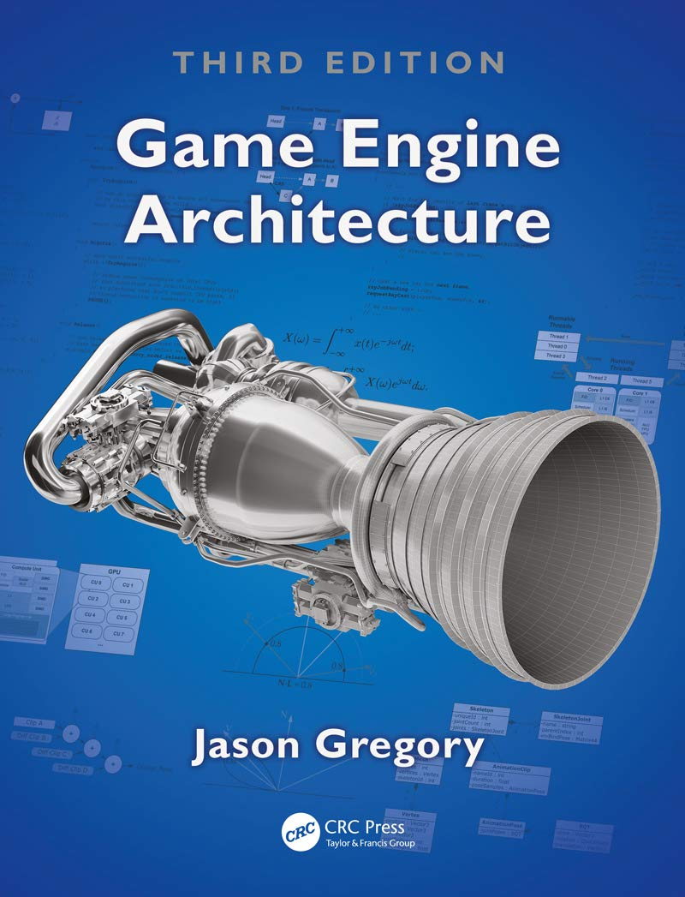

[go back](../README.md)

# Game

Knowledge about game programming is collected here.


Contents:
- [Game Loop](#game-loop)
- [Game Engine](#game-engine)
- [Ressources](#ressources)
- Examples
	- [Simple SDL Game](#simple-sdl-game)


---
### Game Loop

The Game loop is the loop within the game logic and graphics get updated. Different to other applications, a game have to run a loop where the game gets updated until the game ends. 

The famous **FPS** comes right from here. The game loop can run multiple times per second and the FPS (frames per second) says how often the game loop runs in one second. Therefore one iteration of the game loop is called **frame**.

On a high-level this can be splitted into:
- **Input Processing**<br>
	Which can be the input from a controller, keyboard, GPS, ... These can be from one player or for an server with multiple players there would be multiple inputs every frame.
- **Game World Update**<br>
	Updates every object in the game (if needed). For example to apply gravity or updating the position when the player pressed 'w'.
- **Output generation**<br>
	The output is the rendering (graphics), audio (->music, dialogue, effects), controller feedback (like shaking) or sending data to players (in multiplayer games...).

Note that the game loop is paused during 'pause' (if existing) for example by pressing the settings or the menu and the game loop not even started if the game is in the start menu. Sometimes some parts of the game still  loops when pasuing the game. For example some games still let update some graphics or sounds.


---
### Game Engine

...


---
### Ressources

Probably best ressource:


</img>

**Game Engine Architecture, Third Edition** by Jason Gregory (2018/2019)
- [amazon link](https://www.amazon.de/Engine-Architecture-Third-Jason-Gregory/dp/1138035459/ref=sr_1_1)
- [thalia link](https://www.thalia.de/shop/home/artikeldetails/A1048142533)

<br><br>

</img>

**Game Programming in C++: Creating 3D Games** by Sanjay Madhav (2018)
- [amazon link](https://www.amazon.de/Game-Programming-Creating-Addison-Wesley-Development/dp/0134597206/ref=sr_1_1)
- [thalia link](https://www.thalia.de/shop/home/artikeldetails/A1045611597)

<br><br>

</img>

**Components of a Game Engine** by Harold Serrano
- [Gumroad link](https://haroldserrano.gumroad.com/l/componentsofagameengine)

<br>


---
### Examples

Often the best way to learn something is to just see it in the practise and try it by yourself. For that here are some real gaming examples and some informations about it.


---
### Simple SDL Game

A very simple game in C++ using the Simple DirectMedia Library (SDL).

Installing the SDL lib:
1. You can download the **source code** of the lib by downloading the zip folder: https://www.libsdl.org/ and unzipping it. The content can then be copied on a path you know. I recommend to create a 'CPPlibs' (or similiar name) folder and inside a 'uncompiled folder'. In this uncompiled folder you can put every source code lib which is not compiled yet, like our downloaded SDL source code.
2. Next you also have to make sure that the lib is compiled to can use it. For that open your CMD/terminal and navigate to your external lib folder and in your SDL folder:<br>
	```terminal
	D:
	cd CPPlibs/uncompiled
	cd SDL-release-3.2.4
	```
3. Creating the Makefile for SDL Lib and set the output to the folder you want to have the lib:<br>
	```terminal
	mkdir build
	cd build
	cmake -G "MinGW Makefiles" -DCMAKE_INSTALL_PREFIX=D:/CPPlibs/SDL ..
	```
4. Compile your project/build:
	```terminal
	mingw32-make
	mingw32-make install
	```
5. Now there should be 3 files in your SDL target folder:
	- D:/CPPlibs/SDL/include/SDL3
	- D:/CPPlibs/SDL/lib/libSDL3.a
	- D:/CPPlibs/SDL/bin/SDL3.dll

Congratulations, now you should be able to use SDl lib. Just use it like: 
```c++
#include <SDL/SDL.h>
#include <iostream>

int main() {
    if (SDL_Init(SDL_INIT_VIDEO) != 0) {
        std::cerr << "SDL konnte nicht initialisiert werden: " << SDL_GetError() << std::endl;
        return -1;
    } else {
    std::cout << "SDL erfolgreich gestartet!" << std::endl;
    SDL_Quit();
    return 0;
    }
}
```


And compile it using CMake:
```cmd
cd D:
cd Informatik/Projekte/CPP/src/games/01_Simple_SDL_Game
if exist build rd /s /q build
mkdir build
cd build
cmake -G "MinGW Makefiles" ..
mingw32-make 
copy D:\CPPlibs\SDL\bin\SDL3.dll .
```


With this we are ready to program a first simple game and learn some basic concepts.

**SDL Init**<br>
SDL need to be initialized with the *SDL_Init* function. Following subsystem are available:
- SDL_INIT_AUDIO
- SDL_INIT_VIDEO
- SDL_INIT_HAPTIC
- SDL_INIT_GAMECONTROLLER

With following style:
```c++
bool Initialize(){
		// init Video subsystem
		int sdlResult = SDL_Init(SDL_INIT_VIDEO);
		if (sdlResult == 0){
			// create window
			// ...
			return true;
		} else {
			SDL_Log("Unable to init SDL: %s", SDL_GetError());
			return false;
		}
	}
```

FIXME


Take aways:
- How to include an external library (SDL)
- Double Buffering Concept
- ...


---


